# Detecting Windows Attacks with Microsoft Defender ASR and Wazuh

## Overview

Modern Windows attacks frequently abuse legitimate administrative tools and built-in operating system capabilities rather than relying exclusively on traditional malware.

Techniques involving **PowerShell, WMI, PSExec, Office applications, renamed system binaries, and security-control tampering** can provide attackers with execution, persistence, lateral movement, and defense-evasion capabilities.

This project demonstrates how **Microsoft Defender Attack Surface Reduction (ASR)** and **Wazuh** can be combined to build a Windows detection and prevention pipeline.

The objective is not simply to generate alerts. The lab follows an **attack → prevention → telemetry → detection → investigation** workflow.

The lab follows:

```text
Attack
  ↓
Defender ASR
  ↓
Windows Telemetry
  ↓
Wazuh Agent
  ↓
Wazuh Manager
  ↓
Custom Detection Rule
  ↓
MITRE ATT&CK Mapping
  ↓
SOC Investigation
```

---

# Lab Architecture
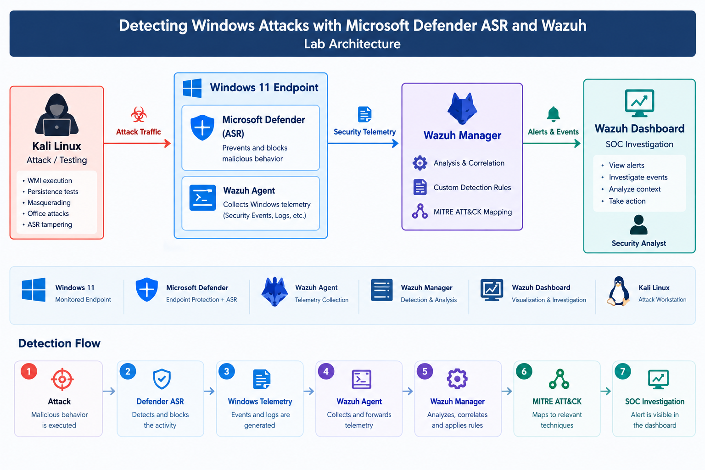


### Lab Environment

| Component          | Role                          |
| ------------------ | ----------------------------- |
| Windows 11         | Monitored endpoint            |
| Microsoft Defender | Endpoint protection           |
| Defender ASR       | Attack prevention             |
| Wazuh Agent        | Telemetry collection          |
| Wazuh Manager      | Detection and analysis        |
| Wazuh Dashboard    | SOC investigation             |
| Kali Linux         | Controlled attack workstation |

---

Implementation

The implementation is divided into two sides:

Endpoint Side
    ↓
Defender ASR + Windows Event Collection

Monitoring Side
    ↓
Wazuh Rules + ATT&CK Detection

The endpoint is responsible for generating security telemetry, while Wazuh is responsible for turning that telemetry into useful detections.

## 1. Configure Microsoft Defender ASR

The first stage is to enable the ASR controls that will be exercised during the attack simulations.

All configuration commands are executed from an elevated PowerShell session.
Run the following commands in **PowerShell as Administrator** to enable the selected ASR rules in Block mode:


```powershell

$rules = @(
    "d1e49aac-8f56-4280-b9ba-993a6d77406c",  # PSExec/WMI process creation
    "e6db77e5-3df2-4cf1-b95a-636979351e5b",  # WMI persistence
    "c0033c00-d16d-4114-a5a0-dc9b3a7d2ceb",  # Copied system tools
    "d4f940ab-401b-4efc-aadc-ad5f3c50688a",  # Office child process
    "3b576869-a4ec-4529-8536-b80a7769e899"   # Office creates executable content
)

foreach ($id in $rules) {
    Add-MpPreference `
        -AttackSurfaceReductionRules_Ids $id `
        -AttackSurfaceReductionRules_Actions Enabled
}
```

### ASR Controls Used

| GUID                                   | Behavior Being Protected          |
| -------------------------------------- | --------------------------------- |
| `d1e49aac-8f56-4280-b9ba-993a6d77406c` | PSExec/WMI process creation       |
| `e6db77e5-3df2-4cf1-b95a-636979351e5b` | WMI persistence                   |
| `c0033c00-d16d-4114-a5a0-dc9b3a7d2ceb` | Copied/impersonated system tools  |

### 2. Confirm the Endpoint Policy

Verify that the ASR rules have been configured:

```powershell
Get-MpPreference |
    Select-Object -ExpandProperty AttackSurfaceReductionRules_Ids
```

Verify the configured ASR actions:

```powershell
Get-MpPreference |
    Select-Object -ExpandProperty AttackSurfaceReductionRules_Actions
```

For this lab, the expected action value is:

```text
1
```

where `1` represents **Enabled/Block** mode.


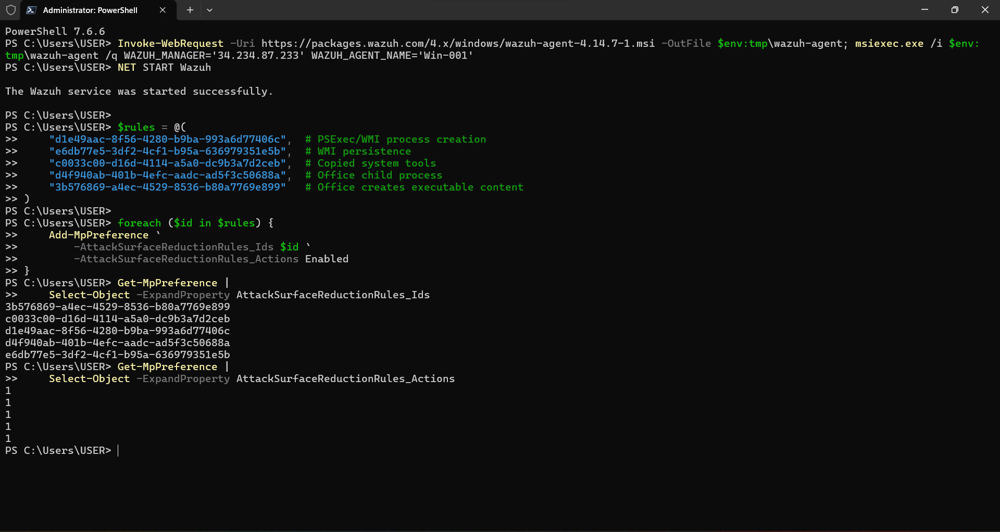

This screenshot provides evidence that the endpoint was actually configured.

### 3. Defender Tamper Protection

Defender configuration can be affected by Tamper Protection. If the ASR settings do not change after running the PowerShell commands, check: Windows Security → Virus & threat protection → Manage settings and review the Tamper Protection state.
For this isolated lab, configuration changes may require temporarily disabling the control. After completing the configuration, restore the security setting.


### 4. Send Defender Telemetry to Wazuh

Enabling ASR alone is not enough for this project. The next requirement is 

getting the resulting Defender events into the monitoring pipeline.

The Wazuh Windows agent is configured to monitor: Microsoft-Windows-Windows

Defender/Operational

Edit: ``` C:\Program Files (x86)\ossec-agent\ossec.conf ```, Inside ```xml <ossec_config>```, add:


```xml
<localfile>
  <location>Microsoft-Windows-Windows Defender/Operational</location>
  <log_format>eventchannel</log_format>
  <query>Event/System[EventID=1121 or EventID=5007]</query>
</localfile>
```


The configuration focuses the collection on two Defender events used by this project:


|Event ID	|Purpose
|-----------|--------
|1121	|ASR blocked activity
|5007	|Defender configuration change

This prevents the project from treating the entire Defender event channel as the detection source.

### 5. Restart the Wazuh Agent

After modifying ossec.conf, restart the agent:

```powershell
Restart-Service -Name wazuh

```
Confirm that it is running:
```powershell
Get-Service -Name wazuh
```
Expected state:
```powershell
Status   Name
------   ----
Running  wazuh
```
Capture the configuration as: images/wazuh-agent-config.png

### 6. Build the Wazuh Detection Layer

Once the endpoint is producing Defender telemetry, the next step is creating detections around the behaviors represented by those events.

From the Wazuh Dashboard: Server management → Rules → Add new rules file

Create: ```windows_asr_rules.xml```

The custom rules used by this project are:
```xml
<group name="windows,defender_asr,">

  <!-- ASR block event classifier -->
  <rule id="100700" level="0">
    <if_sid>62101</if_sid>
    <field name="win.system.eventID">^1121$</field>
    <description>Microsoft Defender ASR block event.</description>
  </rule>

  <!-- WMI / PSExec process creation -->
  <rule id="100701" level="12">
    <if_sid>100700</if_sid>
    <field name="win.eventdata.iD">^D1E49AAC-8F56-4280-B9BA-993A6D77406C$</field>
    <description>
      Attack Surface Reduction blocked process creation via PSExec or WMI:
      $(win.eventdata.path).
    </description>
    <mitre>
      <id>T1047</id>
      <id>T1021.002</id>
      <id>T1570</id>
      <id>T1569.002</id>
    </mitre>
  </rule>

  <!-- WMI persistence -->
  <rule id="100702" level="14">
    <if_sid>100700</if_sid>
    <field name="win.eventdata.iD">^E6DB77E5-3DF2-4CF1-B95A-636979351E5B$</field>
    <description>
      Attack Surface Reduction blocked the creation of a permanent WMI event subscription.
    </description>
    <mitre>
      <id>T1546.003</id>
    </mitre>
  </rule>

  <!-- Masquerading / copied system utility -->
  <rule id="100703" level="12">
    <if_sid>100700</if_sid>
    <field name="win.eventdata.iD">^C0033C00-D16D-4114-A5A0-DC9B3A7D2CEB$</field>
    <description>
      Attack Surface Reduction blocked execution of a copied or impersonated system tool:
      $(win.eventdata.path).
    </description>
    <mitre>
      <id>T1036.003</id>
    </mitre>
  </rule>


  <!-- Defender / ASR configuration change -->
  <rule id="100706" level="7">
    <if_sid>62154</if_sid>
    <field name="win.system.message">ASR\\Rules</field>
    <description>
      Microsoft Defender ASR rule configuration changed:
      $(win.eventdata.newValue).
    </description>
    <mitre>
      <id>T1562.001</id>
    </mitre>
  </rule>

</group>
```

## Detection Logic

The detection logic is organized into **two layers**. This separates the identification of Defender ASR events from the classification of the specific behavior that was blocked.

### Layer 1 — Identify Defender ASR Activity

**Rule `100700`** acts as the initial classifier for Microsoft Defender **Event ID 1121**.

```text
Microsoft Defender Event 1121
            │
            ▼
       Rule 100700
            │
            ▼
    ASR block event identified
```

The rule first establishes that the event represents an **ASR-blocked activity**.

### Layer 2 — Identify the Blocked Behavior

Once Rule `100700` identifies the ASR event, the child rules inspect the **ASR GUID** contained in the event.

```text
                     Event ID 1121
                           │
                           ▼
                       100700
                    ASR Event Classifier
                           │
             ┌─────────────┼─────────────┐
             ▼             ▼             ▼
          100701        100702        100703
             │             │             │
             ▼             ▼             ▼
        WMI / PSExec    WMI           Tool
        Execution     Persistence   Masquerading
```

### Why Use a Layered Detection Model?

This approach provides more context than generating a generic alert such as:

> **"Microsoft Defender blocked something."**

Instead, the detection attempts to answer several questions:

* **What behavior was blocked?**
* **Which ASR control detected it?**
* **What process or path was involved?**
* **Which MITRE ATT&CK technique is relevant?**
* **How severe should the alert be?**


---

## Rule Inventory

| Rule ID  | Purpose                            | Severity |
| -------- | ---------------------------------- | -------: |
| `100700` | ASR block-event classifier         |      `0` |
| `100701` | PSExec/WMI process creation        |     `12` |
| `100702` | WMI persistence                    |     `14` |
| `100703` | Copied/impersonated system utility |     `12` |
| `100706` | ASR configuration modification     |      `7` |

> **Note:** Rule `100700` uses severity `0` because it primarily acts as a classification layer. The child rules generate the higher-severity security alerts.

---

## Apply the Rules

After adding the custom XML rule file to the Wazuh manager, save the changes and select:

**Reload**

This reloads the Wazuh manager's rule set so the newly added detection logic becomes active.

```text
Custom Rules XML
       │
       ▼
     Save
       │
       ▼
     Reload
       │
       ▼
Wazuh Manager loads
new detection logic
```


Capture the completed configuration:

images/wazuh-rules.png

Attack Validation


# Attack Scenario 1 — WMI Process Execution

## Objective

Demonstrate how WMI can be abused to create processes on a Windows endpoint and how Defender ASR can detect/block the behavior.

## Attack Activity

A controlled WMI process creation attempt was performed against the Windows endpoint.

```powershell
Invoke-CimMethod `
    -ClassName Win32_Process `
    -MethodName Create `
    -Arguments @{CommandLine="cmd.exe /c echo test"}
```

## MITRE ATT&CK

* **T1047 — Windows Management Instrumentation**
* **T1569.002 — System Services: Service Execution**

## Detection Result

**Expected outcome:** Defender generates an ASR event and Wazuh generates a corresponding alert.

### 📸 Evidence — Attack Execution && Microsoft Defender Block

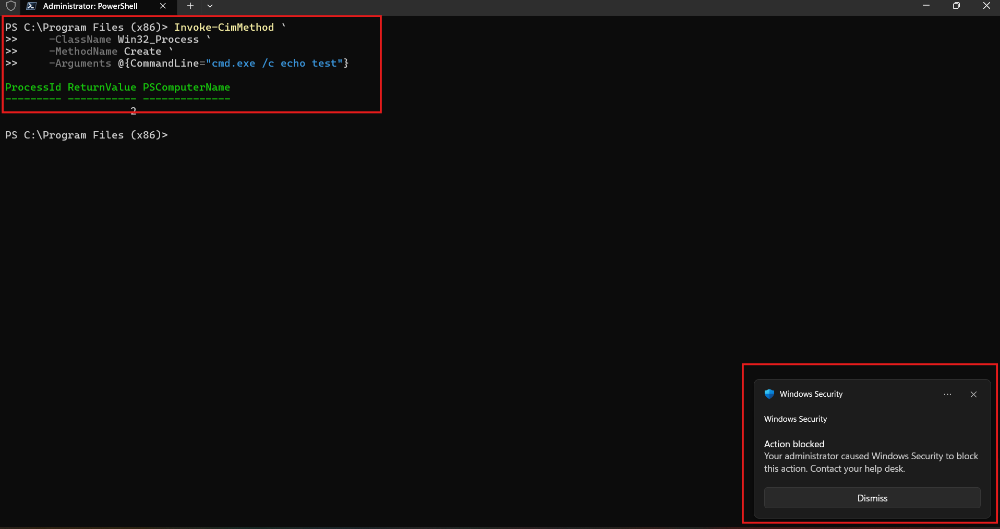


### 📸 Evidence — Wazuh Alert

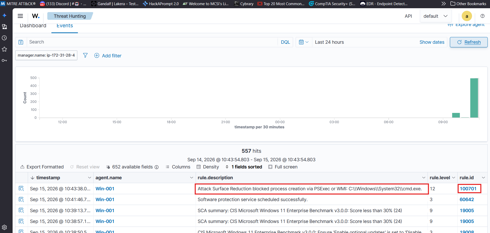

### 📸 Evidence — MITRE Mapping

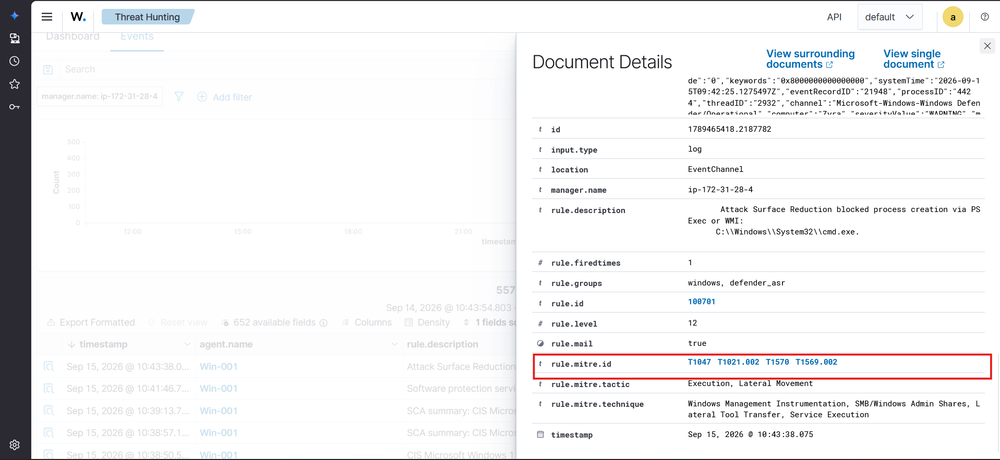
---

# Attack Scenario 2 — WMI Persistence

## Objective

Demonstrate detection of an attempt to establish persistence through Windows Management Instrumentation.

## Attack Activity

A controlled WMI event-subscription persistence test was performed.

```powershell
$FilterName = "RedShield-Test-Filter"
$ConsumerName = "RedShield-Test-Consumer"

$Filter = Set-WmiInstance -Namespace "root\subscription" `
    -Class __EventFilter `
    -Arguments @{
        Name = $FilterName
        EventNamespace = "root\cimv2"
        QueryLanguage = "WQL"
        Query = "SELECT * FROM Win32_ProcessStartTrace"
    }

$Consumer = Set-WmiInstance -Namespace "root\subscription" `
    -Class CommandLineEventConsumer `
    -Arguments @{
        Name = $ConsumerName
        CommandLineTemplate = "cmd.exe /c echo RedShield-WMI-Test >> C:\Windows\Temp\redshield-wmi-test.txt"
    }

Set-WmiInstance -Namespace "root\subscription" `
    -Class __FilterToConsumerBinding `
    -Arguments @{
        Filter = $Filter.__PATH
        Consumer = $Consumer.__PATH
    }

Write-Host "WMI persistence test created."
```


## MITRE ATT&CK

**T1546.003 — Event Triggered Execution: Windows Management Instrumentation Event Subscription**

### 📸 Attack Execution &&  Defender Evidence


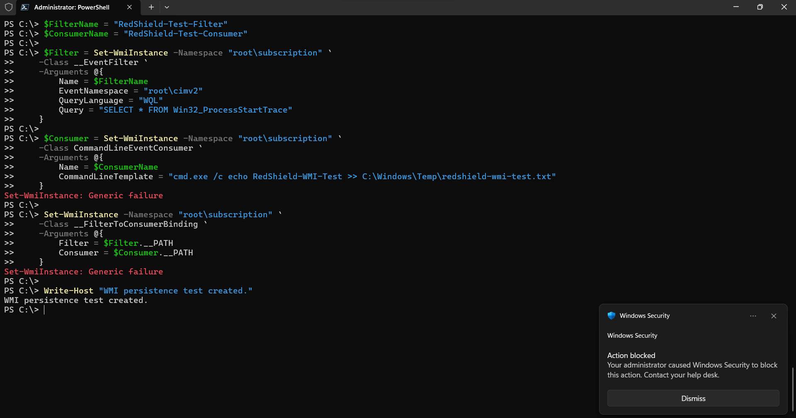

Caption:
Controlled WMI persistence test executed in the laboratory environment.

Microsoft Defender telemetry associated with the WMI persistence attempt.


### 📸 Wazuh Evidence

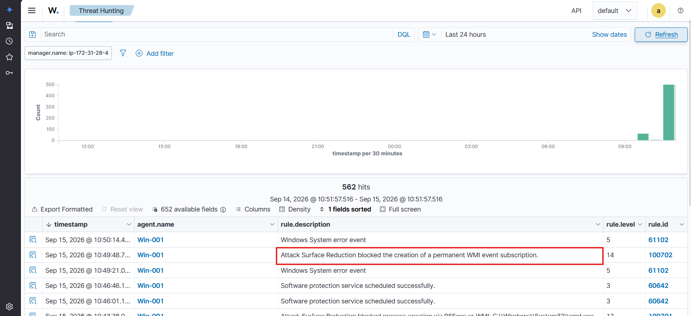

Caption:
Wazuh detection generated from the Defender telemetry.

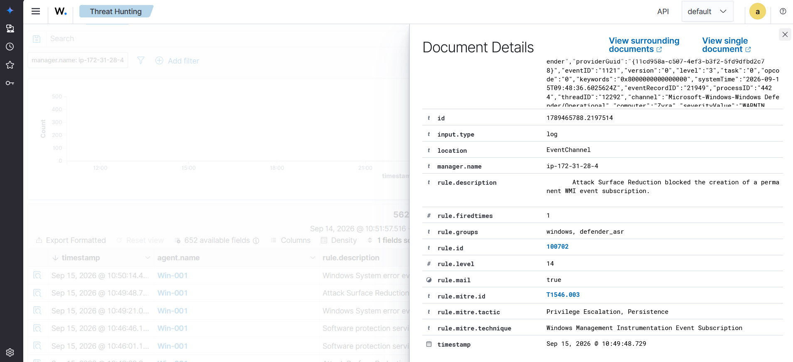

---

# Attack Scenario 3 — System Tool Masquerading

## Objective

Demonstrate how renamed legitimate Windows binaries can be used to disguise suspicious activity.

## Attack Activity

A controlled copy of a legitimate Windows binary was created in a temporary directory.

```powershell
Copy-Item `
    "C:\Windows\System32\notepad.exe" `
    "$env:TEMP\svchost_fake.exe"
```

The file was then executed:

```powershell
Start-Process "$env:TEMP\svchost_fake.exe"
```

## MITRE ATT&CK

**T1036.003 — Masquerading: Rename System Utilities**

### 📸 Attack Execution && Defender Event 


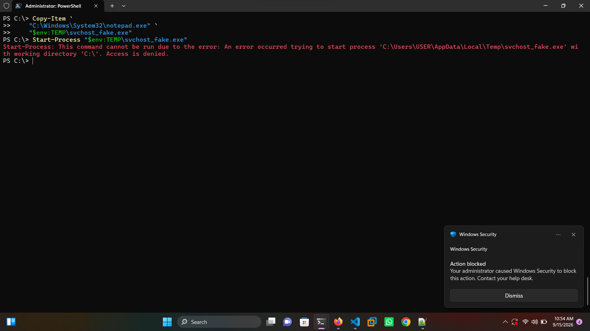

Caption:
Controlled renamed-system-binary test.


### 📸 Wazuh Alert

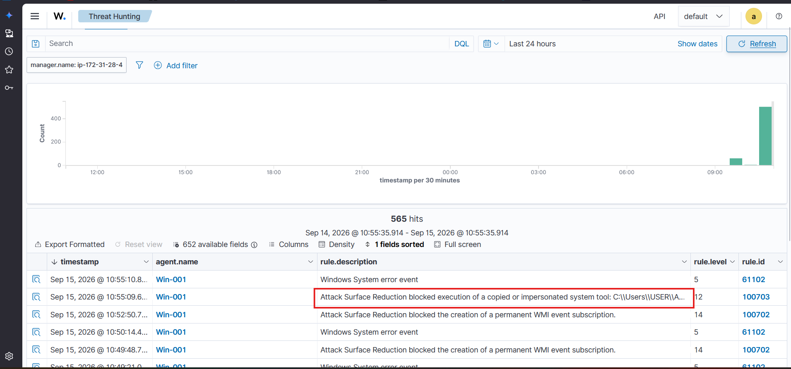

Caption:
Wazuh detection identifying the suspicious system-tool activity.


### Cleanup

```powershell
Remove-Item "$env:TEMP\svchost_fake.exe" -Force
```

---

# Attack Scenario 4 — ASR Configuration Tampering

## Objective

Detect attempts to modify or weaken Microsoft Defender security controls.

Security-control tampering is particularly important because an attacker may attempt to disable defenses before performing additional actions.

### Attack simulation

On the Windows endpoint, open PowerShell as an administrator and run the following command:

```powershell
Add-MpPreference -AttackSurfaceReductionRules_Ids "3b576869-a4ec-4529-8536-b80a7769e899" -AttackSurfaceReductionRules_Actions Disabled 
```


## MITRE ATT&CK

**T1562.001 — Impair Defenses: Disable or Modify Tools**

### 📸 Configuration Change


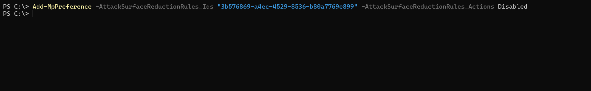

Caption:
Controlled ASR configuration modification used to validate defense-evasion detection.


### 📸 Wazuh Alert

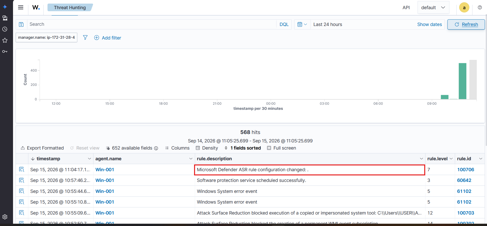

Caption:
Wazuh detecting the Defender configuration change.

---

# Detection Matrix

| Scenario                    | Defender Event | Wazuh Rule | MITRE ATT&CK | Outcome          |
| --------------------------- | -------------: | ---------: | ------------ | ---------------- |
| WMI Process Execution       |           1121 |     100701 | T1047        | Blocked          |
| WMI Persistence             |           1121 |     100702 | T1546.003    | Blocked          |
| System Tool Masquerading    |           1121 |     100703 | T1036.003    | Detected/Blocked |
| ASR Configuration Tampering |           5007 |     100706 | T1562.001    | Detected         |

---

# Evidence Gallery

### Attack Activity

```text

```

### Microsoft Defender

```text

```

### Wazuh Detection

```text

```

### MITRE ATT&CK Mapping

```text

```

---

# Detection Engineering Workflow

The project follows a repeatable detection-engineering methodology:

```text
┌───────────────────────┐
│ 1. Generate Behavior  │
└───────────┬───────────┘
            ↓
┌───────────────────────┐
│ 2. Defender Evaluates │
└───────────┬───────────┘
            ↓
┌───────────────────────┐
│ 3. Windows Telemetry  │
└───────────┬───────────┘
            ↓
┌───────────────────────┐
│ 4. Wazuh Collection   │
└───────────┬───────────┘
            ↓
┌───────────────────────┐
│ 5. Detection Rule     │
└───────────┬───────────┘
            ↓
┌───────────────────────┐
│ 6. ATT&CK Mapping     │
└───────────┬───────────┘
            ↓
┌───────────────────────┐
│ 7. SOC Investigation  │
└───────────────────────┘
```

---


## Conclusion

This project demonstrates how endpoint protection and security monitoring can work together to turn **Windows attack activity into actionable detection intelligence**.

Rather than stopping at the point where Microsoft Defender ASR blocks an attack, the project follows the complete detection lifecycle:

**Attack → Prevention → Telemetry → Detection → Classification → Investigation**

The lab shows how controlled adversarial behavior generates Windows security telemetry, how Wazuh collects and processes that telemetry, and how custom detection rules provide additional context by identifying the blocked behavior and mapping it to **MITRE ATT&CK** techniques.

The key lesson is that effective detection engineering is not simply about creating alerts. A useful detection should provide enough context for an analyst to understand **what happened, why it matters, what behavior was involved, and where to investigate next**.

Ultimately, this project represents my approach to security engineering:

> **Generate the behavior. Capture the telemetry. Build the detection. Map the technique. Investigate the evidence.**

This creates a practical detection pipeline that connects **endpoint security, SIEM monitoring, detection engineering, and SOC investigation** in a single controlled Windows environment.
